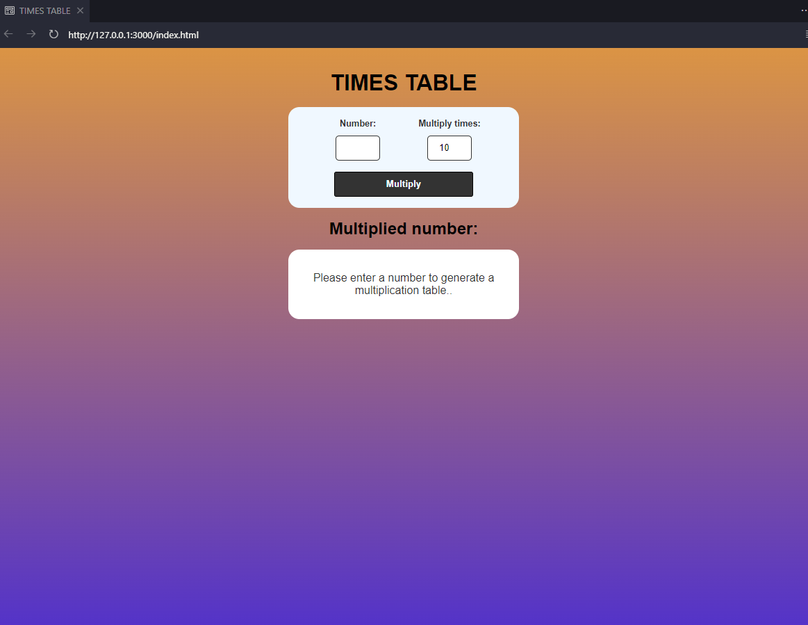
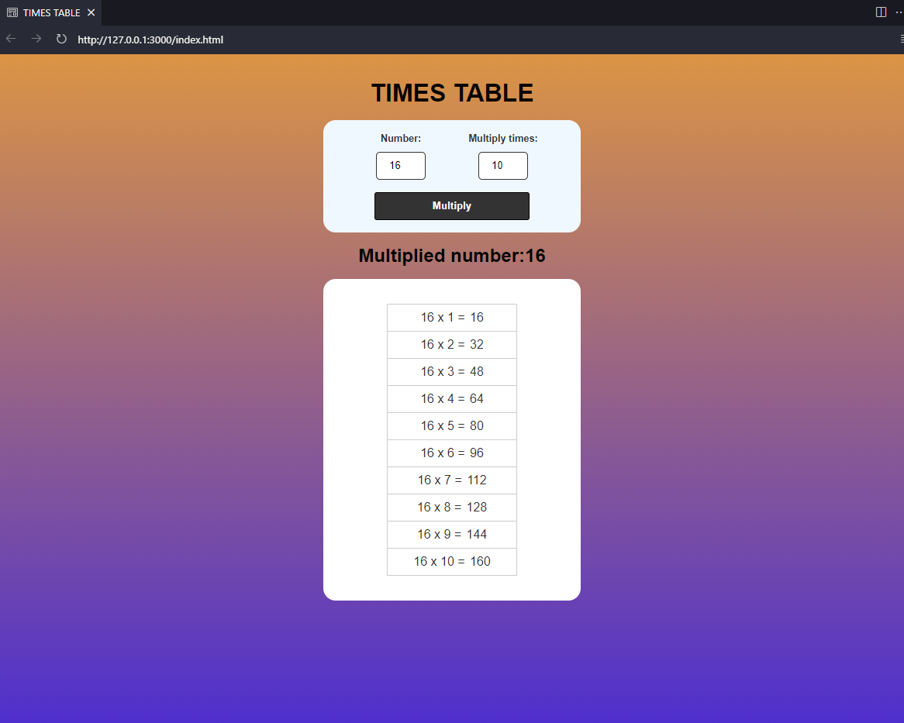

# TIMES TABLE

This project was undertaken to strengthen my skills in HTML, CSS, and JavaScript.

## Project Structure
- **index.html:** Contains the html structure .
- **styles.css:** Style file to enhance the visual presentation.
- **scripts.js** Contains all Multiplication table logic.

## How to use:
1. Clone the repository: `git clone https://github.com/MiguelCapitao/Multiplication-Table-JS.git`
2. Navigate to the project directory: `cd Multiplication-Table-JS`
3. Open the `index.html` file in your browser.

# Project:

 

